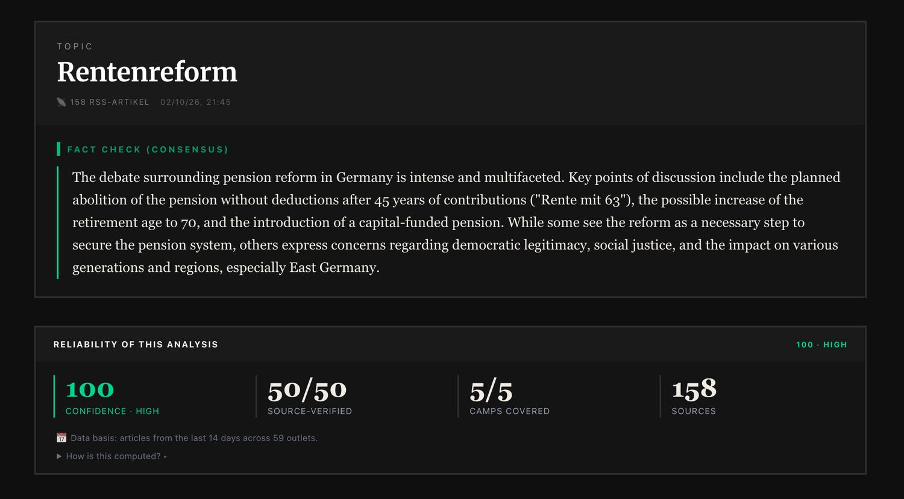
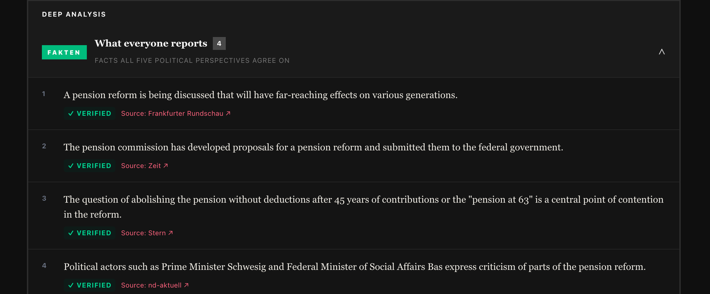
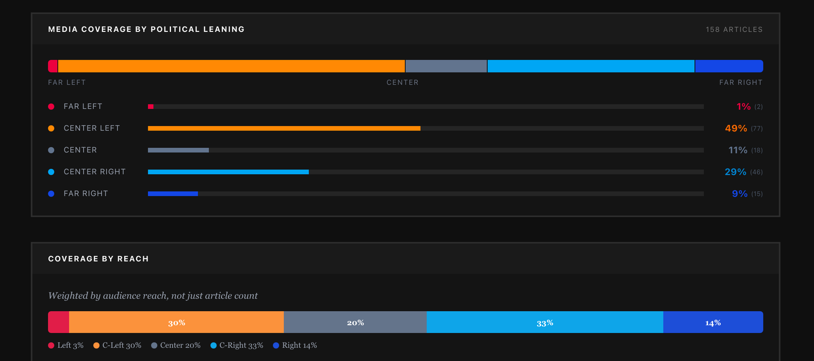
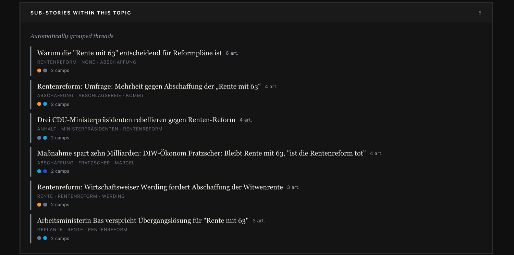
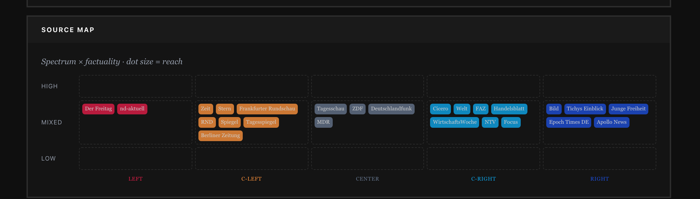

<div align="center">

# NeutraleNachrichten

**Trustworthy AI for media-bias analysis.**
For any topic, see how the entire German political spectrum reported it — what each camp said,
what each camp **omitted**, and a reliability score you can verify.

[](https://www.neutralenachrichten.com)
[](#testing)
[](https://nodejs.org/)
[](https://react.dev/)
[](https://github.com/pgvector/pgvector)
[](LICENSE)

**[🌐 Try it live](https://www.neutralenachrichten.com)** · **[📐 Architecture](ARCHITECTURE.md)**

</div>

---

## The problem

Most people read one or two outlets that already agree with them. The same event gets framed very
differently across the political spectrum — and what one camp **leaves out entirely** is often more
revealing than what it prints. Comparing dozens of outlets by hand is not realistic for a reader.

Existing tools label a whole *outlet* as "left" or "right", once. They never check whether a specific
claim is actually supported by its sources. You have to *trust* the analysis rather than *check* it.

## What this does

Type a topic. The system retrieves real coverage from **59 classified German outlets**, writes a
neutral cross-spectrum comparison, and then puts that output through four verification stages before
anything reaches the reader.

<div align="center">
  
</div>

Every analysis states **how much it can be trusted** and why — confidence, how many claims were
verified against their sources, how much of the spectrum was covered, and how many sources it rests on.

### Verified claims, not vibes

Each synthesized statement is checked against the articles it came from. Supported claims get a
source link; contradicted ones are flagged. This is what catches model hallucinations.

<div align="center">
  
</div>

### Coverage, weighted by reach — and the blind spots

Raw article counts are misleading: ten pieces in niche blogs are not the same as one front page.
Coverage is therefore also weighted by audience reach, and genuine editorial silence is separated
from a feed that simply broke.

<div align="center">
  
</div>

<details>
<summary><b>More screenshots</b> — sub-story clustering, source map</summary>
<br>
<div align="center">
  
  <br><br>
  
</div>
</details>

---

## How it works

```
RSS · 59 classified outlets
        │  background worker, every 30 min
        ▼
derive-and-discard  →  PostgreSQL + pgvector + full-text search
        │
        │  per user request
        ▼
hybrid retrieval (semantic + lexical, RRF k=60)  →  relevance gate
        ▼
LLM cross-spectrum analysis
        ▼
verification: grounding → NLI claim check → confidence → blind spots → clustering
        ▼
answer  (cached: memory → Redis → PostgreSQL)
```

Two services share one database: a **worker** collects news on a schedule, the **API** serves requests
from the ready-built corpus in milliseconds. Neither can take the other down.

📐 **Full technical reference: [ARCHITECTURE.md](ARCHITECTURE.md)**

---

## Engineering decisions worth explaining

These are the problems that actually shaped the codebase.

<details>
<summary><b>Why a separate ingestion worker instead of fetching on request</b></summary><br>

V1 fetched RSS live on every user request: slow (tens of seconds), expensive per analysis, and
legally awkward. V2 splits collection from serving — articles are fetched once on a schedule and
reused across all analyses. That one change took the cost of an analysis down to **≈ €0.08** and the
response time to milliseconds, and it means the worker can crash or redeploy without the site
noticing.
</details>

<details>
<summary><b>Why PostgreSQL + pgvector instead of a dedicated vector database</b></summary><br>

One database instead of two: articles and their embeddings live side by side, so there is nothing to
synchronize and nothing to drift. Hybrid search (vector + full-text) happens in a single query, and
`pgvector`'s HNSW index is comfortably sufficient at this scale. A separate vector store would have
added an entire consistency problem for no benefit here.
</details>

<details>
<summary><b>Why Reciprocal Rank Fusion to merge the two retrievers</b></summary><br>

Semantic search catches paraphrases (*Rentenreform* ↔ *Altersvorsorge-Gesetz*); lexical search nails
exact names, numbers and `§219a`. Neither alone is good enough — but their scores are not comparable:
cosine distance and `ts_rank` live on different scales with different distributions, so any
normalization between them would be arbitrary.

RRF sidesteps this entirely by working on **ranks rather than scores**:

```
score(d) = Σ_lists  1 / (k + rank_list(d))        k = 60
```
</details>

<details>
<summary><b>Derive-and-discard: copyright safety enforced by the schema</b></summary><br>

`corpus_articles` has **no column for full article text**. We store only our own derived summary, a
short lead and a vector embedding. It isn't "we delete the text later" — there is physically nowhere
to put it, so the system cannot drift into republishing someone's content.
</details>

<details>
<summary><b>The confidence bug that taught me the most</b></summary><br>

Confidence scores were stuck at 65/100 on analyses that were obviously well-sourced, with claim
support reading 0%.

The cause was subtle. Synthesis sentences are **abstractive** — the model compresses facts from
several articles into one sentence. So no *single* article entails such a sentence, and the NLI judge
correctly returned `neutral` nearly every time. The verdicts were right; the result was useless.

Two fixes: judge each claim against the **union of its top-3 sources** rather than the single best
match, and treat `neutral` as **unmeasured rather than failed** — excluded from the support ratio
instead of counted as a miss. Confidence went from a stuck 65 to a realistic 84–100 on well-sourced
topics.

The principle stuck, and it runs through the whole reliability layer: *unmeasured is neither perfect
nor zero.*
</details>

<details>
<summary><b>Dependency injection — why the test suite needs no database</b></summary><br>

Everything that performs IO (PostgreSQL, the LLM, RSS) is passed into modules as a parameter rather
than imported directly. Tests substitute fakes, so the entire pipeline — retrieval fusion, grounding,
claim verification, confidence scoring, blind-spot logic — verifies in **under two seconds with no
database and no network**. A project this shape would normally need a running Postgres and take
minutes.
</details>

<details>
<summary><b>Graceful degradation at every layer</b></summary><br>

No pgvector → full-text search still works. No Redis → cache falls back to PostgreSQL. Corpus too
thin for a topic → fall back to live RSS. A feed goes down → recorded in `feed_health`, and the
blind-spot status becomes `unknown` instead of falsely accusing a newsroom of silence. The server
*refuses to start* in production if `JWT_SECRET` is missing or left at its development default.
</details>

---

## Tech stack

| Layer | Technology |
|---|---|
| **Frontend** | React 19, TypeScript, Vite, Tailwind CSS, React Router |
| **Backend** | Node.js 24, Express 5 (ES modules) |
| **Database** | PostgreSQL + pgvector (768-dim, HNSW) + full-text search (German) |
| **AI** | Google Gemini — analysis, NLI verification, embeddings |
| **Cache / limits** | Redis (optional) + in-process cache + PostgreSQL |
| **Testing** | Vitest — 683 tests |
| **Infra** | Railway (web + worker services), Sentry, PostHog |

**~22,500 lines** across 36 backend modules and 36 React components.

---

## Testing

```bash
npm test          # 683 tests · 31 files · ~1.5 s
```

No database and no network required — see the dependency-injection note above.

```bash
npx vitest run tests/blindspot-verification.test.js   # a single file
npx vitest run -t "confidence"                        # by test name
```

---

## Running it

The fastest way to see the system working is **[the live site](https://www.neutralenachrichten.com)** —
running it yourself needs PostgreSQL with `pgvector` and a Gemini API key.

<details>
<summary><b>Local setup</b></summary><br>

**Prerequisites:** Node.js 20+, PostgreSQL 14+ (with the `vector` extension for semantic search), a
Google Gemini API key. Redis optional.

```bash
git clone https://github.com/bogdan-mardyshev/neutralnachrichten.git
cd neutralnachrichten
npm install

cp .env.example .env.local     # fill in DATABASE_URL, GEMINI_API_KEY, JWT_SECRET
npm run dev                    # API + Vite client
```

The schema applies itself on first boot — migrations are idempotent, no migration tool required.

```bash
npm run worker:once            # fill the corpus with one ingestion pass
npm run worker                 # or run it continuously
```

| Command | Purpose |
|---|---|
| `npm run dev` | API and client together |
| `npm run build` | production client build |
| `npm run worker` / `worker:once` | ingestion worker: loop / single pass |
| `npm test` | full test suite |
| `npm run eval:rag` | offline RAG-evaluation harness |

Configuration is documented in [.env.example](.env.example).

Without a Gemini key the app still boots and degrades gracefully: retrieval falls back to full-text
search and analyses are skipped rather than crashing.
</details>

---

## Project structure

```
server.js              API + static SPA serving (~40 routes)
worker.js              ingestion worker entry point
db.js                  PostgreSQL layer, schema, hybrid search

lib/                   33 modules — ingestion, retrieval, reliability
  ├─ ingestionWorker   pure ingestion orchestration
  ├─ hybridRetrieval   RRF fusion
  ├─ reliabilityPipeline  single composition point for the trust layer
  ├─ citationGrounding · claimVerification · entailment
  ├─ confidenceScore · blindspotVerification · storyClustering
  ├─ tractionMetrics   growth/retention analytics
  └─ sourceRatingsSeed 59 outlets on 3 classification axes

components/            36 React components
tests/                 31 files, 683 tests
eval/ · scripts/       RAG-evaluation harness and ops scripts
```

---

## About this project

Built for **NeutraleNachrichten**, a startup founded at SRH University Berlin and supported by its
startup department.

I am the **technical founder and sole developer** — I designed and built the entire system:
the ingestion pipeline, database schema and retrieval layer, the verification stack, the REST API,
the React frontend, the admin analytics, the test suite, and the deployment. My two co-founders lead
business and marketing.

**Current status:** live in production, with real users and a corpus that grows daily. The
engineering is done; what remains is scientific — measuring accuracy against human-labelled data,
calibrating the confidence score, and proving the retrieval is bias-neutral. Those open problems are
documented honestly in [ARCHITECTURE.md §11](ARCHITECTURE.md#11-known-limitations), because a system
that claims to measure trustworthiness should be honest about its own.

**Bogdan Mardyshev** — [bogdan.mardyshev@gmail.com](mailto:bogdan.mardyshev@gmail.com)

## License

MIT — see [LICENSE](LICENSE).
